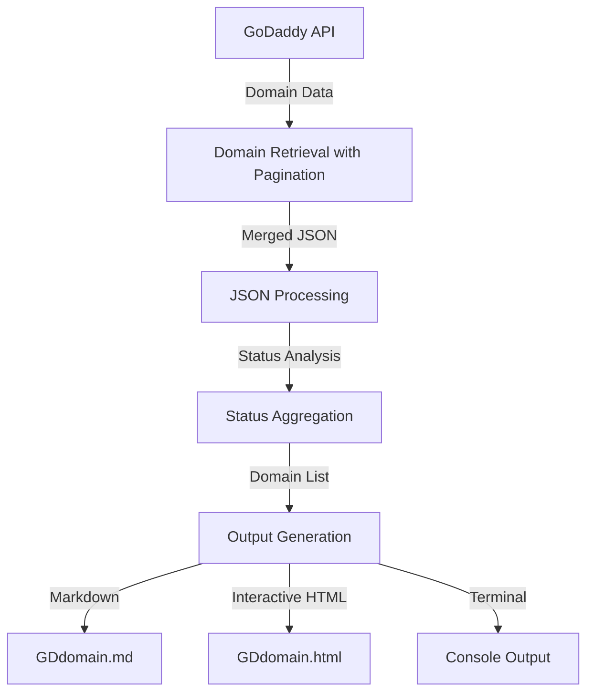

<a href="https://www.buymeacoffee.com/0xDTC"></a>
___
# Domain Fetch Script by **0xDTC**

This script, developed by 0xDTC, fetches domain data from the GoDaddy API and aggregates it into a single JSON file. It dynamically identifies and counts all domain statuses, ensuring flexibility for future additions. The script generates both Markdown and interactive HTML output for easy viewing and analysis.

## Features

1. **Fetch Domains:** Retrieves domain data from the GoDaddy API in pages and saves it in a JSON file (`domains.json`).
2. **Dynamic Aggregation:** Automatically identifies and counts all unique domain statuses.
3. **Pagination Support:** Handles large datasets by managing API pagination seamlessly.
4. **Human-Readable Output:** Generates a clear summary of domain statuses directly in the terminal.
5. **Interactive HTML Report:** Creates an HTML file with sortable tables, search filters, and CSV export functionality.
6. **Markdown Documentation:** Generates a clean markdown file for quick reference and sharing.

## Data Flow Diagram



## Prerequisites

1. **Bash Shell:**
    - Ensure you have a Bash shell environment (Linux/macOS/WSL on Windows).

2. **API Credentials:**
    - Create a `secret.txt` file in the same directory as the script and add the following:
    ```sh
    API_KEY="your_api_key"
    API_SECRET="your_api_secret"
    ```

3. **Dependencies:**
    - Install the JSON processor `jq` required for parsing API responses:
    ```sh
    sudo apt install jq     # For Debian/Ubuntu
    brew install jq         # For macOS
    sudo yum install jq     # For Red Hat/CentOS
    ```

## How to Use

### Step 1: Clone or Download the Script
- Save the script to your desired directory.

### Step 2: Configure `secret.txt`
- Create a `secret.txt` file with the following format:
    ```sh
    API_KEY="your_api_key"
    API_SECRET="your_api_secret"
    ```

### Step 3: Run the Script
- Make the script executable and run it:
    ```sh
    chmod +x script_name.sh   # Make the script executable
    ./script_name.sh          # Run the script
    ```

### Step 4: Review Output
- The fetched domains will be temporarily saved in `domains.json` (deleted after processing).
- A dynamic summary of domain statuses will be printed to the terminal.
- Two output files will be generated:
  - `GDdomain.md`: Markdown format of domain data
  - `GDdomain.html`: Interactive HTML report with filtering and sorting capabilities

#### Counts of Domains by Status:
```
ACTIVE                   : 1138
CANCELLED                : 76
PENDING_TRANSFER         : 24
EXPIRED_REASSIGNED       : 1
Domains fetched successfully.
```

## Configuration Options

- **PAGE_SIZE:** Adjust the number of domains fetched per API request by modifying the `PAGE_SIZE` variable in the script.
- **Output Files:** Change the name or path of the output files by editing the `output_file`, `markdown_file`, and `html_file` variables.

## Error Handling

- If the API returns an empty response, the script will stop and display:
    ```
    Failed to fetch domains.
    ```
- If the script reaches the end of available data, it will stop further requests and display:
    ```
    No more pages to fetch.
    ```

## Example Output

### Terminal Output:
```
Counts of Domains by Status:
-----------------------------
ACTIVE                   : 1138
CANCELLED                : 76
PENDING_TRANSFER         : 24
EXPIRED_REASSIGNED       : 1
Output saved to:
- /path/to/GDdomain.md (Markdown format)
- /path/to/GDdomain.html (HTML format)
```

### Markdown File (`GDdomain.md`):
```markdown
Counts of Domains by Status:
-----------------------------
ACTIVE                   : 1138
CANCELLED                : 76
PENDING_TRANSFER         : 24
EXPIRED_REASSIGNED       : 1

Domains and Their Statuses:
---------------------------------------
Domain                                   | Status              
---------------------------------------  | --------------------
example1.com                             | ACTIVE              
example2.com                             | CANCELLED           
```

### HTML Output (`GDdomain.html`):
The HTML output provides an interactive web interface with the following features:
- Sortable columns (click on column headers)
- Search/filter functionality for each column
- Export to CSV button
- Responsive design for mobile and desktop viewing
- Clean, modern styling
