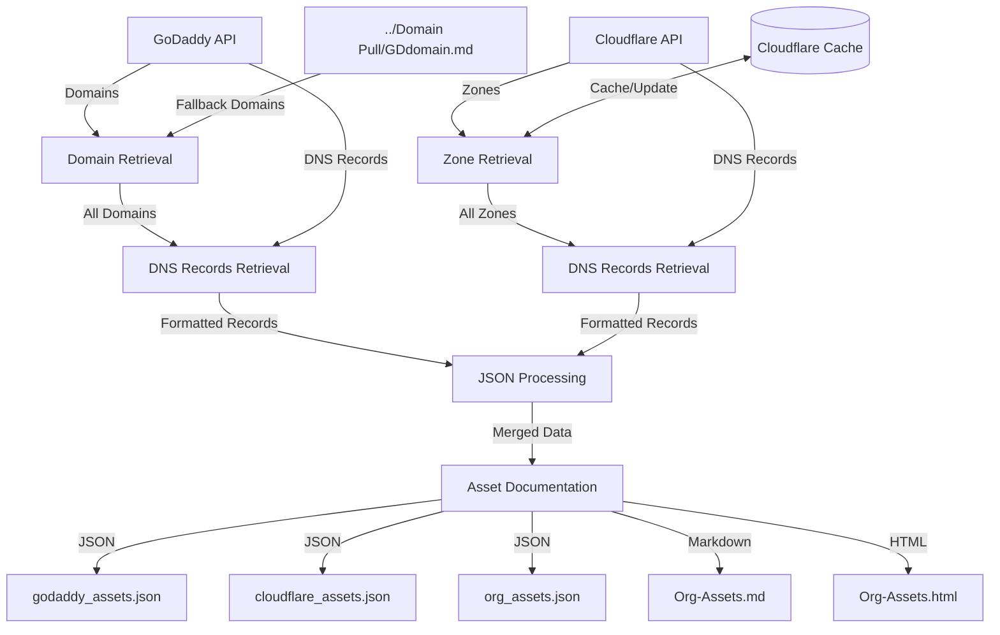

<a href="https://www.buymeacoffee.com/0xDTC"></a>

# Organization Assets Generator

Automates domain and subdomain retrieval from GoDaddy and Cloudflare, then generates comprehensive asset documentation in both Markdown and HTML formats. The interactive HTML report provides advanced features for analyzing and managing your domain assets.

## Features
- Fetch domains from GoDaddy API with robust pagination support
- Retrieve all DNS records (A, CNAME, TXT, etc.) from GoDaddy and Cloudflare with full pagination
- Process all active domains (now handles 1000+ domains)
- Enhanced error handling and rate limiting protection
- Cache Cloudflare zones for one week to reduce API calls
- Group and sort records by domain and subdomain
- Track discovery dates for all assets
- Generate interactive HTML report with filtering and sorting
- Generate clean Markdown table output
- Handle API quota limits gracefully
- Optional logging for debugging

## Data Flow Diagram



## Prerequisites
- Bash shell (Linux, macOS, or WSL)
- jq (for JSON parsing)  
    • Debian/Ubuntu: `sudo apt install jq`  
    • macOS: `brew install jq`  
    • Red Hat/CentOS: `sudo yum install jq`  
- GoDaddy API key/secret (saved in secret.txt)
- Cloudflare API token (saved in secret.txt)

## Installation
1. Clone the repo:  
     `git clone https://github.com/0xdtc/0xGodaddy.git`  
2. `cd '0xGodaddy/Subdomain Pull'`
3. `chmod +x GDSubDomains` 

## Usage
```
./GDSubDomains [-l]
```
(-l enables logging to script_debug.log; default logs to /dev/null)

## What the Script Does
1. Fetch domains from GoDaddy (with quota awareness)
2. Fetch and cache Cloudflare zones (refreshed weekly)
3. Retrieve subdomain DNS records from both GoDaddy and Cloudflare
4. Add discovery dates to all assets
5. Merge and sort results into org_assets.json
6. Generate Org-Assets.md for a simple table view
7. Generate Org-Assets.html with interactive features:
   - Sortable columns
   - Search/filter functionality
   - Responsive design
   - CSV export
   - Collapsible long entries

## Output Files
- `godaddy_assets.json`: Assets from GoDaddy
- `cloudflare_assets.json`: Assets from Cloudflare
- `org_assets.json`: Combined assets from both providers
- `Org-Assets.md`: Markdown table documentation
- `Org-Assets.html`: Interactive HTML documentation
- `cloudflare_zones_cache.json`: Cached Cloudflare zones (refreshed weekly)

## Demo Output (Markdown Format)
| Domain | Subdomain | Type | Data | Source | Discovery Date |
|--------|-----------|------|------|--------|----------------|
| demo.com | @ | A | 192.0.2.1 | GoDaddy | 2025-04-12 |
| demo.com | blog | CNAME | blog.example.net | GoDaddy | 2025-04-12 |
| demo.com | mail | MX | mail.example.net | Cloudflare | 2025-04-12 |
| demo.com | www | CNAME | demo.com | GoDaddy | 2025-04-12 |
| sample.org | @ | A | 203.0.113.5 | Cloudflare | 2025-04-12 |
| sample.org | api | A | 203.0.113.10 | GoDaddy | 2025-04-12 |
| sample.org | app | CNAME | app.example.com | Cloudflare | 2025-04-12 |
| sample.org | www | CNAME | sample.org | GoDaddy | 2025-04-12 |

## Customization
- Adjust PAGE_SIZE in the script for domain fetch size
- Modify the Cloudflare zone cache duration (default is 7 days)
- Customize HTML styling in the generate_asset_documentation function

## Troubleshooting
- Check credentials in ../secret.txt
- Ensure jq is installed and in PATH
- Use -l flag for detailed logs in script_debug.log
- If GoDaddy API quota is exceeded, the script will continue with Cloudflare assets only
- For HTML rendering issues, check browser console for JavaScript errors

## Support
Open an issue or buy me a coffee at the link above.